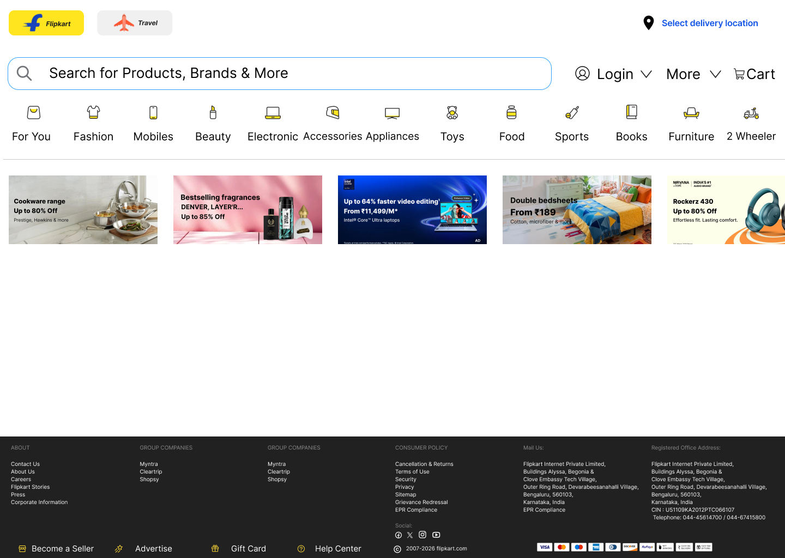

# 🛒 Flipkart Clone — Frontend

> A pixel-perfect frontend clone of Flipkart built from scratch using pure **HTML & CSS** for hands-on learning.  
> UI/UX designed in **Figma** before implementation.

---

## 📌 Project Overview

| Field | Detail |
|---|---|
| **Type** | Frontend Only (No JS, No Framework) |
| **Stack** | HTML5 + CSS3 |
| **Design Tool** | Figma |
| **Purpose** | Hands-on practice & skill building |
| **Reference** | [Flipkart](https://www.flipkart.com) |

---

## 🖼️ Live Preview

### 🏠 Home Page


> **Sections visible:** Top Nav → Search Bar → Category Nav → Marquee Banners → Footer

---

## 🎨 UI/UX Design — Figma

All pages were **designed in Figma first**, then converted to code.

- Figma File Link → *(add your link here)*
- Design includes: wireframes → lo-fi → hi-fi mockups
- Components designed: Navbar, Hero Banner, Marquee Banners, Category Grid, Footer

| Section | Status |
|---|---|
| 🔝 Top Nav (Logo, Travel, Location) | ✅ Done |
| 🔍 Mid Nav (Search, Login, Cart) | ✅ Done |
| 📂 Bottom Nav (Categories) | ✅ Done |
| 🎠 Marquee Banner | ✅ Done |
| 🦶 Footer | ✅ Done |

---

## 📁 Folder Structure

```
EnhancedFlipkartClone/
│
├── index.html                  # Main Entry Point (Single Page)
│
├── cssModule/                  # All CSS files — modular structure
│   ├── body.css                # Global body styles, resets, variables
│   ├── topNav.css              # Top navigation bar (logo, Travel, location)
│   ├── midNav.css              # Search bar, Login, More, Cart
│   ├── bottomNav.css           # Category navigation links
│   ├── hero.css                # Hero / main banner section
│   ├── marquee.css             # Scrolling marquee banner (1234px)
│   └── footer.css              # Footer — dark theme, multi-column
│
├── static/                     # Static assets
│   ├── icons/                  # UI icons (SVG / PNG)
│   └── images/                 # All images used in project
│
├── screenshots/                # Project screenshots for README
│   └── homepage.png            # Full home page preview
│
└── README.md
```

---

## ✅ What I Built — Pages

- [x] Home Page (Navbar, Banners, Categories, Product Grid, Footer)
- [x] Marquee / Scrolling Banner Section
- [ ] Product Listing Page
- [ ] Product Detail Page
- [ ] Cart Page
- [ ] Login / Signup Page

---

## 🧠 Concepts Learned

### 📄 HTML — Full Coverage

#### Structure & Boilerplate
- `DOCTYPE`, `<html>`, `<head>`, `<body>` — page skeleton
- `<meta charset>`, `<meta viewport>` — responsive setup & SEO
- `<title>`, `<link>`, `<script>` — head elements

#### Semantic HTML
- `<header>`, `<nav>`, `<main>`, `<section>`, `<article>`, `<aside>`, `<footer>`
- `<figure>`, `<figcaption>` — image with caption
- `<address>` — contact info

#### Text & Content Tags
- Headings: `<h1>` to `<h6>`
- Paragraph: `<p>`, Line break: `<br>`, Horizontal rule: `<hr>`
- Bold: `<strong>`, Italic: `<em>`, Underline: `<u>`
- `<span>` — inline wrapper, `<div>` — block wrapper
- `<small>`, `<mark>`, `<del>`, `<ins>`, `<sub>`, `<sup>`

#### Links & Media
- `<a href>` — internal, external, anchor links, `target="_blank"`
- `` — images with accessibility
- `<video>`, `<audio>` — media embeds
- `<iframe>` — embedded content (maps, videos)

#### Lists
- `<ul>` — unordered list
- `<ol>` — ordered list
- `<li>` — list item
- `<dl>`, `<dt>`, `<dd>` — definition list

#### Tables
- `<table>`, `<thead>`, `<tbody>`, `<tfoot>`
- `<tr>`, `<th>`, `<td>`
- `colspan`, `rowspan` attributes

#### Forms
- `<form action method>` — form wrapper
- `<input>` types: `text`, `password`, `email`, `number`, `checkbox`, `radio`, `file`, `range`, `date`, `search`, `submit`
- `<label for>` — accessibility linking
- `<select>`, `<option>`, `<optgroup>` — dropdowns
- `<textarea>` — multi-line input
- `<button type>` — buttons
- `<fieldset>`, `<legend>` — grouping
- Attributes: `placeholder`, `required`, `disabled`, `readonly`, `autofocus`, `maxlength`, `pattern`, `value`, `name`, `id`

#### HTML Attributes
- `class`, `id` — selectors
- `data-*` — custom data attributes
- `aria-label`, `alt` — accessibility
- `href`, `src`, `rel`, `type`, `style`

#### Miscellaneous HTML
- HTML Comments `<!-- -->`
- Entities: `&nbsp;`, `&copy;`, `&amp;`, `&lt;`, `&gt;`
- `<template>` tag concept

---

### 🎨 CSS — Full Coverage (Except Animations)

#### Basics & Selectors
- Universal `*`, Type `div`, Class `.class`, ID `#id`
- Grouping `h1, h2, h3`
- Descendant `div p`, Child `div > p`, Adjacent `h1 + p`, Sibling `h1 ~ p`
- Attribute selectors: `[type="text"]`, `[href^="https"]`
- Pseudo-classes: `:hover`, `:focus`, `:active`, `:visited`, `:checked`, `:disabled`, `:nth-child()`, `:first-child`, `:last-child`, `:not()`
- Pseudo-elements: `::before`, `::after`, `::placeholder`, `::selection`, `::first-line`

#### Cascade, Specificity & Inheritance
- Specificity order: inline > ID > class > element
- `!important` (and why to avoid it)
- `inherit`, `initial`, `unset`, `revert` values

#### Box Model
- `width`, `height`, `min-width`, `max-width`, `min-height`, `max-height`
- `padding` (top, right, bottom, left — shorthand & longhand)
- `margin` (shorthand, `auto` centering, negative margins)
- `border` (width, style, color — shorthand)
- `border-radius` — rounded corners
- `outline` vs `border`
- `box-sizing: border-box` — most important fix

#### Display & Visibility
- `display: block`, `inline`, `inline-block`, `none`
- `visibility: hidden` vs `display: none`
- `opacity: 0` vs `visibility: hidden`

#### Flexbox (Core Layout)
- `display: flex`
- `flex-direction`: row, column, row-reverse, column-reverse
- `justify-content`: flex-start, flex-end, center, space-between, space-around, space-evenly
- `align-items`: stretch, flex-start, flex-end, center, baseline
- `align-content` — multi-line control
- `flex-wrap`: nowrap, wrap, wrap-reverse
- `gap`, `row-gap`, `column-gap`
- Child properties: `flex-grow`, `flex-shrink`, `flex-basis`, `flex` shorthand
- `align-self` — per-child override
- `order` — reorder without changing HTML

#### CSS Grid (Layout)
- `display: grid`
- `grid-template-columns`, `grid-template-rows`
- `fr` unit — fractional space
- `repeat()`, `minmax()`, `auto-fill`, `auto-fit`
- `gap`, `row-gap`, `column-gap`
- `grid-column`, `grid-row` — span control
- `grid-area`, `grid-template-areas` — named layout
- `justify-items`, `align-items`, `place-items`
- `justify-content`, `align-content`

#### Positioning
- `position: static` — default
- `position: relative` — offset from normal flow
- `position: absolute` — relative to nearest positioned parent
- `position: fixed` — fixed to viewport (navbar use)
- `position: sticky` — hybrid scroll behavior
- `top`, `right`, `bottom`, `left` — offset properties
- `z-index` — stacking order

#### Typography
- `font-family`, font stacks, system fonts, Google Fonts
- `font-size` (px, em, rem)
- `font-weight` (100–900, bold, normal)
- `font-style` (normal, italic, oblique)
- `line-height` — readability
- `letter-spacing`, `word-spacing`
- `text-align` (left, right, center, justify)
- `text-decoration` (underline, none, line-through, overline)
- `text-transform` (uppercase, lowercase, capitalize)
- `text-overflow: ellipsis` — truncate overflow text
- `white-space: nowrap` — prevent wrapping
- `word-break`, `overflow-wrap`

#### Colors & Backgrounds
- Color formats: Named, HEX `#fff`, RGB `rgb()`, RGBA `rgba()`, HSL `hsl()`, HSLA
- `background-color`
- `background-image: url()`
- `background-size`: cover, contain, auto, px/%
- `background-position`: center, top, bottom, left, right
- `background-repeat`: no-repeat, repeat, repeat-x
- `background-attachment`: fixed (parallax effect)
- `background` shorthand
- Linear gradients: `linear-gradient()`
- Radial gradients: `radial-gradient()`
- Multiple backgrounds

#### Shadows & Effects
- `box-shadow`: offset-x, offset-y, blur, spread, color, inset
- `text-shadow`: offset-x, offset-y, blur, color
- Multiple shadows (comma separated)
- `filter`: blur(), brightness(), contrast(), grayscale(), drop-shadow()
- `backdrop-filter` — glass morphism effect

#### Overflow & Clipping
- `overflow`: visible, hidden, scroll, auto
- `overflow-x`, `overflow-y`
- `clip-path` — custom shape clipping

#### CSS Units
- Absolute: `px`, `pt`, `cm`
- Relative: `%`, `em`, `rem`, `vw`, `vh`, `vmin`, `vmax`
- `auto` keyword

#### CSS Variables (Custom Properties)
- Declaring: `--primary-color: #2874f0;`
- Using: `color: var(--primary-color);`
- Fallback values: `var(--color, red)`
- `:root` scope — global variables

#### Transitions (Non-Animation)
- `transition-property`, `transition-duration`, `transition-timing-function`, `transition-delay`
- `transition` shorthand
- Timing functions: `ease`, `linear`, `ease-in`, `ease-out`, `ease-in-out`, `cubic-bezier()`

#### Transform (Static & Hover)
- `translate(x, y)`, `translateX()`, `translateY()`
- `scale(x, y)`, `scaleX()`, `scaleY()`
- `rotate(deg)`
- `skew(x, y)`
- `transform-origin`
- Multiple transforms chained

#### Object Fit & Images
- `object-fit`: fill, contain, cover, none, scale-down
- `object-position`

#### Cursor & Interaction
- `cursor`: pointer, default, not-allowed, grab, crosshair, text, zoom-in
- `pointer-events: none` — disable click
- `user-select: none` — disable text selection

#### Responsive Design — Media Queries
- `@media screen and (max-width: 768px) {}`
- Breakpoints: Mobile 480px, Tablet 768px, Desktop 1024px+
- `min-width` vs `max-width` approach
- Mobile-first strategy

#### Miscellaneous CSS
- CSS Reset vs Normalize
- `*` universal box-sizing fix
- `list-style: none` — remove bullets
- `text-decoration: none` — remove link underline
- `outline: none` — remove focus outline (with care)
- `:root` pseudo-class
- CSS Comments `/* */`

---

## ⏳ Currently Learning

- [ ] CSS Animations (`@keyframes`, `animation` property)
- [ ] CSS Scroll Behavior
- [ ] Advanced Pseudo-elements

---

## 🔗 Resources Used

- [MDN Web Docs](https://developer.mozilla.org) — HTML & CSS reference
- [CSS Tricks — Flexbox Guide](https://css-tricks.com/snippets/css/a-guide-to-flexbox/)
- [CSS Tricks — Grid Guide](https://css-tricks.com/snippets/css/complete-guide-grid/)
- [Google Fonts](https://fonts.google.com)
- [Figma](https://figma.com) — UI/UX Design

---

## 👨‍💻 Author

**Akarsh**  
BTech CSE (3rd Year)  
Learning frontend through real-world project cloning.

---

> *"Best way to learn is to build something real."*